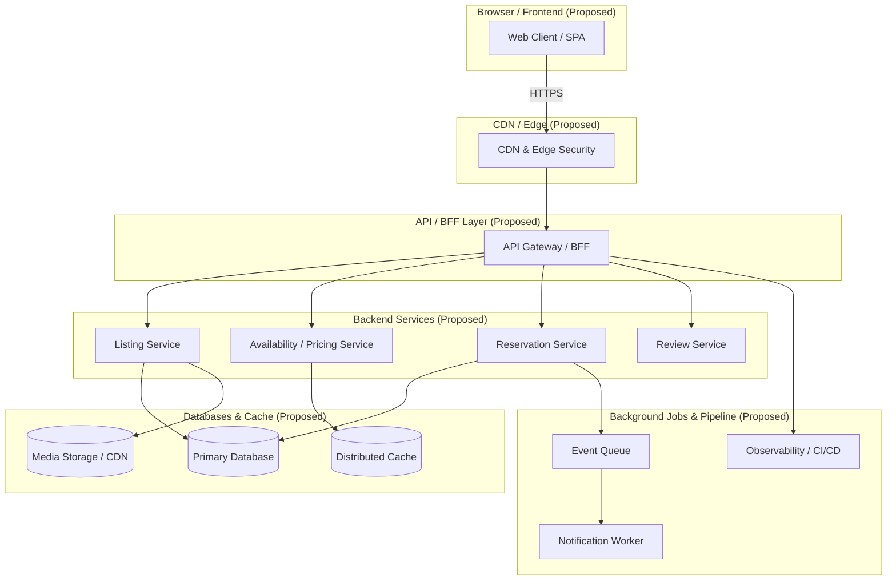

# System Architecture Document

## 1. Purpose and Evidence Boundary

### Purpose of the Application
The PlayPower Airbnb Clone is a desktop-focused single-page React application that replicates an Airbnb property listing page. It provides an interactive interface for viewing property details, navigating image galleries via Photo Tour and Lightbox modals, inspecting amenities and sleeping arrangements, and calculating estimated reservation totals based on dates and guest counts.

### Evidence Boundary & Verification Status
All statements in this architecture document are explicitly classified into one of the following verification tiers based on direct inspection of project source files and local terminal execution results.

*   **Source Verified:** Directly confirmed through static code analysis of the provided project source files (`package.json`, `src/App.jsx`, `src/data/listing.js`, `src/components/*`, `src/App.css`, `src/index.css`).
*   **Locally Verified:** Confirmed through local terminal executions provided in the current environment context.
    *   `npm run lint`: PASS (ESLint exited without errors).
    *   `npm run build`: PASS (`dist/index.html` 0.47 kB, `dist/assets/index-CQUY_IPM.css` 16.96 kB, `dist/assets/index-DLq7IdNf.js` 240.21 kB).
    *   `npm run dev`: PASS (Dev server started on `http://localhost:5173/`).
*   **Historical Evidence:** Sourced from project records covering Phases 0 through 8. These capture engineering context but do not substitute for real-time automated tests or browser verification.
*   **Browser Verified:** NOT VERIFIED. No automated end-to-end browser runtime, visual regression, or browser DOM inspection tests were executed in this phase.
*   **Not Verified / Unverified:** Includes browser rendering, pixel fidelity, visual comparison against reference designs, image loading states, Photo Tour and Lightbox focus trapping/restoration in live browsers, keyboard handling in browsers, responsive viewport resizing, and Mermaid diagram rendering.

---

## 2. Current Technology Stack

Based on static inspection of `package.json` and local execution outputs:

| Layer | Technology | Version / Specification | Source / Verification Details |
| :--- | :--- | :--- | :--- |
| **Framework / Library** | React | `^19.0.0` | Specified in `package.json` |
| **DOM Engine** | React DOM | `^19.0.0` | Specified in `package.json` |
| **Build Tool / Bundler** | Vite | Declared: `^6.2.0`<br>Observed CLI: `v8.3.0` | `package.json` specifies range `^6.2.0`; resolved CLI during `npm run build` reports `v8.3.0` |
| **Linting** | ESLint | `^9.21.0` | Specified in `package.json` |
| **Compiler / Plugin** | `@vitejs/plugin-react` | `^4.3.4` | Specified in `package.json` |
| **Language** | JavaScript (JSX) | ESNext / React JSX | Source inspection |
| **Styling** | Vanilla CSS | Custom Properties, Flexbox, CSS Grid | `src/App.css`, `src/index.css` |
| **State Management** | Native React Hooks | `useState`, `useMemo`, `useRef`, `useEffect` | Source inspection |
| **Data Layer** | Static JavaScript Module | `src/data/listing.js` | Source inspection |
| **Routing** | None | Single-page layout using native anchor links (`#href`) | Source inspection |
| **Backend Services** | None | Client-side static application | Source inspection |
| **Automated Testing** | None | Not established by the supplied source | Source inspection |

---

## 3. Application Entry Flow

The client runtime initialization follows standard Vite single-page application entry architecture:


```

index.html
└── 
└── 
└── src/main.jsx
├── imports React & ReactDOM
├── imports src/index.css & src/App.css
├── imports App from ./App.jsx
└── ReactDOM.createRoot(document.getElementById('root')).render()
└── App.jsx
├── Imports static listing data from src/data/listing.js
└── Renders layout components & conditional modal overlays

```

---

## 4. Actual Component Hierarchy

Derived directly from `src/App.jsx` imports and JSX render tree:


```

App (src/App.jsx)
├── Header (src/components/Header.jsx)
├── ListingHeader (src/components/ListingHeader.jsx)
├── ImageGallery (src/components/ImageGallery.jsx)
├── [Main Layout Grid Container]
│   ├── [Left Column: Content Sections]
│   │   ├── PropertySummary (src/components/PropertySummary.jsx)
│   │   ├── Description (src/components/Description.jsx)
│   │   └── Amenities (src/components/Amenities.jsx)
│   └── [Right Column: Sticky Sidebar]
│       └── ReservationCard (src/components/ReservationCard.jsx)
├── Footer (src/components/Footer.jsx)
├── PhotoTour (src/components/PhotoTour.jsx) [Conditional Modal Overlay]
└── Lightbox (src/components/Lightbox.jsx) [Conditional Modal Overlay]

```

*Note: Dedicated sub-components such as `Location`, `Reviews`, or `Host` are not present as individual files in `src/components/`. Host details are rendered directly within `PropertySummary`.*

---

## 5. State Ownership

Inspected from source implementations across all components:

### `App.jsx`
*   `isPhotoTourOpen` (`useState(false)`): Boolean controlling `PhotoTour` modal visibility.
*   `lightboxIndex` (`useState(null)`): Integer index or `null` controlling `Lightbox` modal visibility and active image selection.
*   `photoTourTriggerRef` (`useRef(null)`): Stores DOM reference of the trigger element opening `PhotoTour`.
*   `lightboxTriggerRef` (`useRef(null)`): Stores DOM reference of the trigger element opening `Lightbox`.

### `ListingHeader.jsx`
*   `saved` (`useState(false)`): Toggles saved/heart state.
*   `shareFeedback` (`useState("")`): Text message state displaying feedback on share actions.

### `ReservationCard.jsx`
*   `checkIn` (`useState("")`): Date string (`YYYY-MM-DD`).
*   `checkOut` (`useState("")`): Date string (`YYYY-MM-DD`).
*   `guests` (`useState(1)`): Guest count integer.
*   `nights` (`useMemo`): Computed integer difference between `checkIn` and `checkOut`.
*   `subtotal` & `total`: Derived numerical values calculated during rendering.

### `Description.jsx`
*   `expanded` (`useState(false)`): Toggles between collapsed and full description paragraph list.

### `Amenities.jsx`
*   `showAll` (`useState(false)`): Toggles between truncated slice (4 items) and full list of amenities.

### `PhotoTour.jsx`
*   `closeButtonRef` (`useRef(null)`): Reference for initial close button focus on mount.
*   `photoTourRef` (`useRef(null)`): Reference to dialog container for focus-trap query selections.
*   `useEffect` (Scroll Lock): Sets `document.body.style.overflow = "hidden"` on mount and restores previous value on unmount.
*   `useEffect` (Keyboard & Focus): Contains keydown listener handling `Escape` key close and `Tab` key focus trapping within `photoTourRef`. Contains conditional check on `isLightboxOpen` to bypass keydown processing when Lightbox is open.

### `Lightbox.jsx`
*   `closeButtonRef` (`useRef(null)`): Reference for initial close button focus on mount.
*   `lightboxRef` (`useRef(null)`): Reference to dialog container for focus-trap query selections.
*   `useEffect` (Scroll Lock): Sets `document.body.style.overflow = "hidden"` on mount and restores previous value on unmount.
*   `useEffect` (Keyboard & Focus): Contains keydown listener handling `Escape`, `ArrowLeft`, `ArrowRight`, and `Tab` key focus trapping within `lightboxRef`.

---

## 6. Data Flow

Data flow is strictly unidirectional, fed by the static data module:


```

src/data/listing.js (Exported Static JS Objects)
├── listing (Object: title, location, rating, reviewCount, host, highlights, description, sleepingArrangements, amenities, images, pricing)
└── footerGroups (Array: section titles and link lists)
│
▼ Imported into src/App.jsx
├── listing -> ListingHeader
├── listing.images -> ImageGallery
├── listing -> PropertySummary
├── listing -> Description
├── listing.amenities -> Amenities
├── listing.pricing, rating, reviewCount -> ReservationCard
├── footerGroups -> Footer
├── listing.images -> PhotoTour [When open]
└── listing.images -> Lightbox [When open]

```

*   **Data Model:** Static local JavaScript objects.
*   **API / Persistence:** Not established by the supplied source.

---

## 7. Interaction and Event Flow

| Action / Element | Source Event Handler | Source Implementation Logic | Verification Status |
| :--- | :--- | :--- | :--- |
| **Save Toggle** | `ListingHeader.jsx` | Toggles `saved` boolean state; updates heart icon fill and button label. | Source behavior present |
| **Share Button** | `ListingHeader.jsx` | Tries `navigator.share`; falls back to `navigator.clipboard.writeText` or document copy command; sets `shareFeedback`. | Source behavior present |
| **Check-in Date** | `ReservationCard.jsx` | Updates `checkIn` state; resets `checkOut` if `checkIn >= checkOut`. | Source behavior present |
| **Checkout Date** | `ReservationCard.jsx` | Updates `checkOut` state with `min` restriction set to `checkIn`. | Source behavior present |
| **Guest Counter** | `ReservationCard.jsx` | Clamps `guests` state between `1` and `maxGuests` (6). | Source behavior present |
| **Pricing Calculation**| `ReservationCard.jsx` | `useMemo` parses date strings to timestamps, computes night count delta, and multiplies by `pricePerNight`; adds static fees. | Source behavior present |
| **Description Toggle** | `Description.jsx` | Toggles `expanded` state; displays full text or sliced text array. | Source behavior present |
| **Amenities Toggle** | `Amenities.jsx` | Toggles `showAll` state; displays full array or sliced 4-item array. | Source behavior present |
| **Gallery Clicks** | `ImageGallery.jsx` | Clicking photos triggers `onOpenLightbox(index, targetElement)`; "Show all photos" triggers `onOpenPhotoTour(targetElement)`. | Source behavior present |
| **Photo Tour Open** | `App.jsx` | Sets `isPhotoTourOpen = true`; records `currentTarget` in `photoTourTriggerRef`. | Source behavior present |
| **Photo Tour Close**| `App.jsx` / `PhotoTour.jsx` | Sets `isPhotoTourOpen = false`; unmount effect restores focus to `photoTourTriggerRef.current`. | Source behavior present |
| **Lightbox Open** | `App.jsx` | Sets `lightboxIndex = index`; records `currentTarget` in `lightboxTriggerRef`. | Source behavior present |
| **Lightbox Close** | `App.jsx` / `Lightbox.jsx` | Sets `lightboxIndex = null`; unmount effect restores focus to `lightboxTriggerRef.current`. | Source behavior present |
| **Lightbox Nav** | `Lightbox.jsx` | Calls `onPrevious` / `onNext` handlers passed from `App.jsx` to decrement/increment `lightboxIndex`. | Source behavior present |
| **Escape Key** | Overlays | Keyboard keydown listeners call `onClose`. `PhotoTour` skips execution if `isLightboxOpen` is `true`. | Source behavior present |
| **Arrow Keys** | `Lightbox.jsx` | Keydown listener maps `ArrowLeft` to `onPrevious` and `ArrowRight` to `onNext`. | Source behavior present |
| **Focus Trapping** | Overlays | Keydown listener intercepts `Tab` / `Shift+Tab` to loop focus across focusable elements inside container refs. | Source behavior present |
| **Scroll Locking** | Overlays | `useEffect` sets `document.body.style.overflow = "hidden"` on mount and resets on unmount. | Source behavior present |

*Runtime browser execution of all above interactions remains Browser Unverified.*

---

## 8. Photo Tour

*   **Props:** `images`, `onClose`, `onOpenLightbox`, `isLightboxOpen`.
*   **State & Refs:** Internal refs (`closeButtonRef`, `photoTourRef`). Visually controlled by parent state `isPhotoTourOpen`.
*   **Rendering:** Full-screen modal overlay (`role="dialog"`, `aria-modal="true"`) rendering close header and a scrollable grid of property images with click handlers to launch Lightbox.
*   **Event & Keyboard Logic:** Source logic present. Keydown listener handles `Escape` for closing and `Tab` for focus looping within `photoTourRef`. An explicit check (`if (isLightboxOpen) return;`) bypasses `PhotoTour` keydown processing when Lightbox is active over Photo Tour.
*   **Focus Handling Logic:** Source logic present. Focuses `closeButtonRef` on mount; traps focus inside container. Unmount focus restoration is managed via `photoTourTriggerRef` in `App.jsx`.
*   **Scroll Locking Logic:** Source logic present. `useEffect` sets `document.body.style.overflow = "hidden"` on mount and restores previous value on unmount.
*   **Runtime Verification:** Source behavior present; live browser execution, focus trapping, focus restoration, and screen-reader interaction remain *Browser Unverified*.

---

## 9. Lightbox

*   **Props:** `images`, `activeIndex`, `onClose`, `onPrevious`, `onNext`.
*   **State & Refs:** Internal refs (`closeButtonRef`, `lightboxRef`). Visually controlled by parent state `lightboxIndex`.
*   **Rendering:** Full-screen modal overlay (`role="dialog"`, `aria-modal="true"`) displaying single active image, image counter (`Photo X of Y`), previous/next navigation buttons, and close button.
*   **Event & Keyboard Logic:** Source logic present. Keydown listener handles `Escape` (calls `onClose`), `ArrowLeft` (calls `onPrevious`), `ArrowRight` (calls `onNext`), and `Tab` (focus loop inside `lightboxRef`).
*   **Focus Handling Logic:** Source logic present. Focuses `closeButtonRef` on mount; traps focus inside container. Unmount focus restoration is managed via `lightboxTriggerRef` in `App.jsx`.
*   **Scroll Locking Logic:** Source logic present. `useEffect` sets `document.body.style.overflow = "hidden"` on mount and restores previous value on unmount.
*   **Runtime Verification:** Source behavior present; live browser execution, focus trapping, focus restoration, and screen-reader interaction remain *Browser Unverified*.

---

## 10. CSS Architecture

Styles are organized across two global stylesheets:

### Global Setup (`index.css`)
*   CSS reset rules (`box-sizing: border-box`, margin/padding normalization).
*   System font stack definitions.
*   Root CSS custom properties (color tokens, neutral shades, font weights, shadows).

### App & Component Styling (`App.css`)
*   **CSS Custom Properties:** Color tokens for text, borders, surface colors, brand accents, button hover states.
*   **Layout Structure:** Centered max-width containers (`1120px`), flexbox header, main grid layout (`63%` left content / `33%` right sidebar with `4%` gap).
*   **Image Gallery Grid:** CSS Grid layout with hero image spanning 2 rows on the left and a 2x2 grid of secondary photos on the right.
*   **Sticky Reservation Card:** `position: sticky; top: 80px;` sidebar card container with border-radius, shadows, and interior flex containers.
*   **Overlays & Modals:** `position: fixed; inset: 0; z-index: 1000;` full-viewport styling for `PhotoTour` and `Lightbox` with dark transparent backdrops (`rgba(0,0,0,0.85)`).
*   **Focus & Accessibility Styles:** High-contrast outline focus rings using `:focus-visible`.
*   **Reduced Motion:** `@media (prefers-reduced-motion: reduce)` block disabling transitions.
*   **Responsive Rules:** Media queries adapting grid columns to single-column stacking for smaller viewport thresholds.

---

## 11. Current Limitations

*   **Static Local Data:** All property details, reviews, host info, and image lists originate from static JavaScript object exports (`src/data/listing.js`).
*   **External Image Dependencies:** Photos rely on external image URLs (Unsplash CDN) requiring internet connectivity to load.
*   **No Backend or Persistence:** Reservations and user interactions (e.g., clicking "Reserve", saving, changing dates) do not persist to a database or call an external API.
*   **No Client-Side Routing:** Header and footer links rely on hash anchors (`#stay`, `#terms`) rather than client-side routing.
*   **Browser Verification Limitations:** Visual rendering accuracy, screen-reader audio, image loading states, and live DOM focus trapping have not been confirmed via browser automated test runs.

---

## 12. Production-Scale Architecture

*PROPOSED / FUTURE — NOT IMPLEMENTED*

The diagram below outlines a high-level conceptual production architecture designed to scale an enterprise property listing platform.


```

+-----------------------------------------------------------------------------------+
|                                 BROWSER / FRONTEND                                |
|  +-----------------------------------------------------------------------------+  |
|  | Single Page Application / Mobile Client / Web App                           |  |
|  +-----------------------------------------------------------------------------+  |
+------------------------------------------+----------------------------------------+
|
v
+-----------------------------------------------------------------------------------+
|                                     CDN / EDGE                                    |
|  +---------------------------+  +-----------------------+  +-------------------+  |
|  | Content Delivery Network  |  | Web Application FW    |  | Edge Caching      |  |
|  +---------------------------+  +-----------------------+  +-------------------+  |
+------------------------------------------+----------------------------------------+
|
v
+-----------------------------------------------------------------------------------+
|                                    API / BFF                                      |
|  +-----------------------------------------------------------------------------+  |
|  | API Gateway / Backend-for-Frontend (BFF) Layer                              |  |
|  | (Authentication, Rate Limiting, Request Routing, Load Balancing)              |  |
|  +-----------------------------------------------------------------------------+  |
+-------------------+----------------------+-------------------+--------------------+
|                      |                   |
+-----------+                      |                   +-----------+
v                                  v                               v
+-----------------------+  +-------------------------------+  +-----------------------+
|   LISTING SERVICE     |  | AVAILABILITY / PRICING SERVICE|  |  RESERVATION SERVICE  |
+-----------+-----------+  +---------------+---------------+  +-----------+-----------+
|                              |                              |
+------------------------------+------------------------------+
|
v
+-----------------------------------------------------------------------------------+
|                              DATABASES / CACHE / MEDIA                            |
|  +-----------------------+  +-------------------------------+  +------------------+  |
|  | Primary Database      |  | Distributed Cache             |  | Media Storage /  |  |
|  | (Listings, Users)     |  | (Session, Pricing)            |  | CDN Asset Store  |  |
|  +-----------------------+  +-------------------------------+  +------------------+  |
+------------------------------------------+----------------------------------------+
|
v
+-----------------------------------------------------------------------------------+
|                  BACKGROUND JOBS / NOTIFICATIONS / OBSERVABILITY                  |
|  +-----------------------+  +-------------------------------+  +------------------+  |
|  | Event Bus / Messaging |  | Notification Workers          |  | CI/CD & Metrics  |  |
|  +-----------------------+  +-------------------------------+  +------------------+  |
+-----------------------------------------------------------------------------------+

```

---

## 13. Mermaid Architecture Diagram

*PROPOSED / FUTURE — NOT IMPLEMENTED (Mermaid rendering not verified)*



---

## 14. Current vs Future

| Concern | Current Implementation | Proposed Production Architecture |
| --- | --- | --- |
| **Data** | Static local listing data | API-backed listing service |
| **State** | Local React state | Server/client state architecture |
| **Pricing** | Client-side calculation | Server-authoritative pricing |
| **Images** | Current image URLs | Managed media/CDN pipeline |
| **Persistence** | None | Persistent database |
| **Reservations** | UI-only | Reservation service |
| **Testing** | Lint/build currently verified | Automated unit/E2E/visual testing |
| **Delivery** | Vite-built SPA | CDN/edge + production frontend |

```

---
